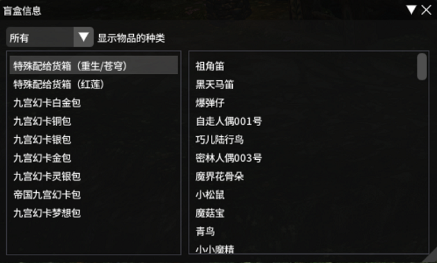

# BlindBoxPlugin

用来统计盲盒中物品获得情况的插件。当前仅支持军票盲盒。

## 安装

1. 卫月设置 -> 测试版
2. 添加仓库 `https://raw.githubusercontent.com/he0119/FFXIVBlindBoxPlugin/main/repo.json` 并启用
3. 从插件列表中安装

## Credits

- [GoodMemory](https://github.com/VergilGao/GoodMemoryCN)
- [最终幻想XIV中文维基](https://ff14.huijiwiki.com/wiki/%E9%A6%96%E9%A1%B5)
